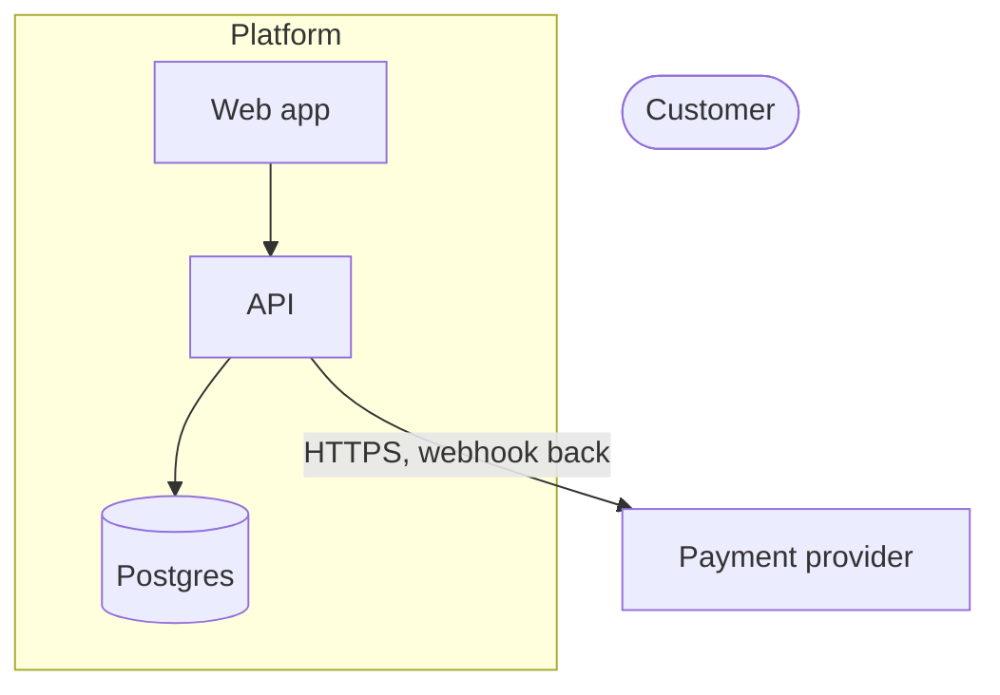

# System architecture

The charter (`.claude/ENGINEERING.md` § Architecture) says what good structure looks like. This is
the procedure for *arriving at* one and leaving evidence behind.

Architecture fails in two directions. Under-designing is obvious by month six — no seams, everything
tangled. Over-designing looks like competence: services split before there is a reason, an
abstraction with one implementation, a message bus moving twelve events a day. The second is more
expensive, because it is defended.

## Step 0 — Constraints, before reading any code

The things that determine structure are not in the filesystem. Read the repo first and you anchor
the design to what exists instead of what is needed.

Ask at most **four** questions, and only the ones that would change the answer:

- **Scale now, and in ~12 months.** Order of magnitude is enough. 100 → 100k users changes almost
  everything; 100k → 120k changes almost nothing.
- **Who operates it.** Solo, one team, several. Team topology predicts correct service boundaries
  more reliably than domain purity — a solo developer running six services has built a distributed
  monolith with extra pager duty.
- **What hurts right now.** Deploy friction, latency, cost, onboarding, incident rate, or nothing
  yet. A review with no named pain has no ranking function.
- **Hard limits.** Budget, compliance and data residency, vendor commitments, latency SLAs,
  languages the team actually knows.

Unanswered, proceed — but mark every assumed constraint inline: `[assumed: ~1k DAU]`. Never present
a recommendation as settled when it rests on an assumption.

## Every recommendation carries a revisit trigger

For each significant choice state: the driving constraint (given or assumed) · what was rejected and
why · **what would have to change for the rejected option to become correct**.

> Monolith now; split billing out when it needs an independent deploy cadence or a second team owns
> it.

That is a decision. "Monolith" alone is an opinion. Decisions with triggers get revisited without
re-litigating everything.

## Step 1 — Discovery, when there is a repo

Targeted reads. `ls -R` on a real repository floods the context and buries the signal.

```bash
git ls-files | wc -l
git ls-files | grep -vE 'node_modules|dist|build' | head -100
git log --format='%an' | sort | uniq -c | sort -rn | head -20
```

Then read the manifests directly — `package.json`, `pyproject.toml`, `go.mod`, `Cargo.toml`.
Dependencies describe the real architecture faster than the source does.

Look for these, and **note their absence**:

| Signal | Where | What it tells you |
|---|---|---|
| Infrastructure | `Dockerfile`, `terraform/`, `k8s/`, `.github/workflows/` | How it actually deploys |
| Data | migrations, ORM config, schema files | The most honest document in the repo |
| Boundaries | which modules import which | Where seams already are — and where they were attempted and abandoned |
| Entry points | HTTP handlers, queue consumers, cron, CLI | The real surface area |
| Team | contributor count, commit cadence | Operational complexity this team can absorb |

State what you could not determine. A review that quietly guesses at the data model is worse than
one that says the data model was not legible.

## Step 2 — Do only the work the request needs

Selectable, not a pipeline. Announce which one in a line, then do it.

| Request | Deliver |
|---|---|
| "Draw a C4 L2" | Discovery + diagram. No ADRs, no migration plan |
| "Should we switch to X?" | Constraints + ADR with real alternatives. Diagram only if topology changes |
| "Review this architecture" | Discovery + findings ranked by cost of inaction |
| "Design a migration to Y" | Full: constraints, current and target diagrams, ADRs, phased plan |
| Greenfield "how should I build this" | Constraints + target diagram + the 2–3 decisions expensive to reverse |

## C4 — only the levels that earn their place

- **L1 Context** — system, users, external systems. Cheap; include for anything beyond one component.
- **L2 Container** — deployable units: apps, APIs, databases, queues, caches. Where the argument
  actually happens. Include whenever topology is in question.
- **L3 Component** — internals of *one* container, only when its module boundaries are the subject.
- **L4** — never. The code is the code.

Generate levels **sequentially in one pass**. Names, boundaries and abbreviations must match across
levels, and independently generated diagrams drift on exactly those.

Use Mermaid `flowchart` with subgraphs. Mermaid's dedicated `C4Context`/`C4Container` syntax is
flagged experimental and renders inconsistently — verify in the target renderer before relying on it.



Label every edge with protocol and direction of data. An unlabelled arrow hides the decision.

## ADRs

Write one for any choice **expensive to reverse**: datastore, deployment model, sync vs async
boundary, auth approach, multi-tenancy, framework lock-in. Skip them for reversible choices — they
become paperwork nobody reads, which discredits the ones that matter.

`docs/adr/NNNN-kebab-case-title.md`, zero-padded, sequential. **Never renumber.** Supersede rather
than edit: a new ADR referencing the old, plus a `Superseded by ADR-00NN` line at the top of the
original.

```markdown
# ADR-0007: Postgres as the primary datastore

- **Status:** Proposed | Accepted | Superseded by ADR-00NN
- **Date:** YYYY-MM-DD

## Context
The forces in play — constraint, scale, what is painful. Mark assumed facts as assumed.

## Options considered
### Option A — name
Pros · cons · cost · what it commits us to.
### Option B — name

## Decision
Which, and the specific reason it wins *under these constraints*.

## Consequences
**Positive:** …
**Negative:** … — name at least one. A decision with no downside was not examined.
**Risks and mitigations:** …

## Revisit when
The concrete trigger: a scale threshold, a second team, a latency SLA, a cost ceiling.
```

Never introduce a technology without an "Options considered" section containing a real alternative —
including the alternative of not adding it.

## Deliverable

Reports go to a file, appended as each finding settles — see `agent-harness-runtime`.

```markdown
# [Architecture review | Design | Migration plan] — <system>

**Scope:** what was and was not examined
**Constraints:** given vs [assumed: …]
**Verdict:** 2–3 sentences, most important thing first

## Current state
## Findings / Design
Ranked by cost of leaving it alone. Each: what it is · what it costs · what to do ·
what it would take to be wrong about this.
## Decisions requiring an ADR
## Implementation sequence
Ordered, each step independently shippable. Mark which are reversible.
## Deliberately not doing
Considered and rejected, one line each. This section stops the same debate recurring monthly.
```

## Judgment

- **Rank by cost of inaction**, never by how architecturally offensive something is. An
  ugly-but-stable module nobody touches is not a finding.
- **Prefer the reversible move.** Where two options are close, take the one cheaper to undo.
  Extracting a service later is normal; merging services back is a project.
- **Modular monolith before services**, unless team topology or genuine independent scaling says
  otherwise. Say plainly when the honest answer is "you don't need this yet".
- **The data model outlives the code.** Spend disproportionate attention there. Schema and boundary
  mistakes are still expensive three years in.
- **Name what you don't know.** "I can't assess query patterns without production traffic" is a
  senior answer. Invented specifics are the failure this procedure exists to prevent.
- **Disagree with the premise when the premise is wrong.** Being asked to plan a microservices
  migration is not evidence that one is needed.

Source: adapted from `senior-solution-architect` (MIT).
